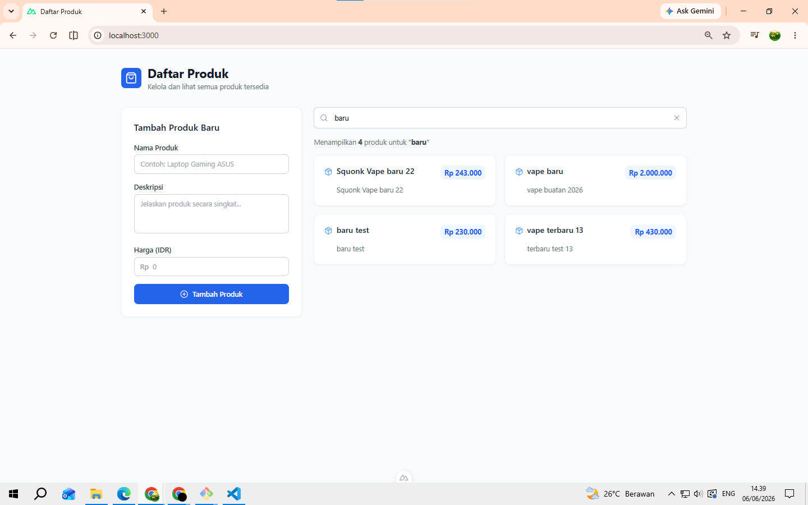
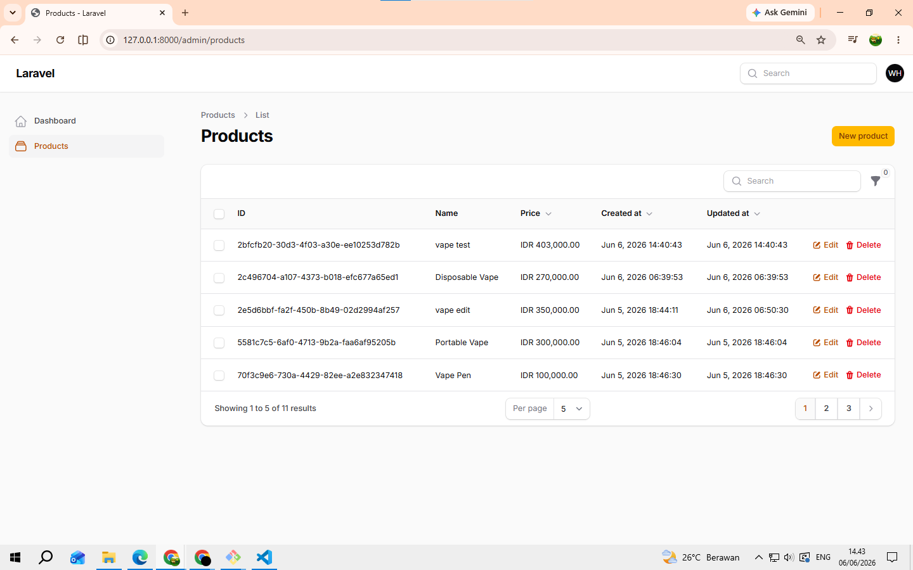
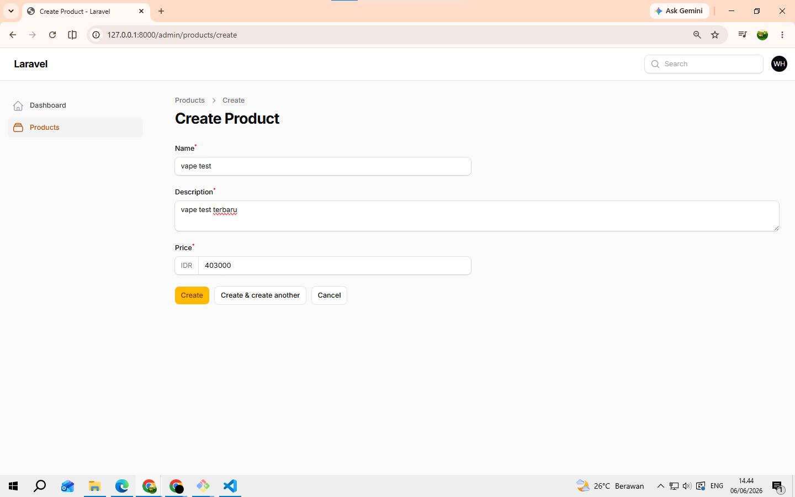
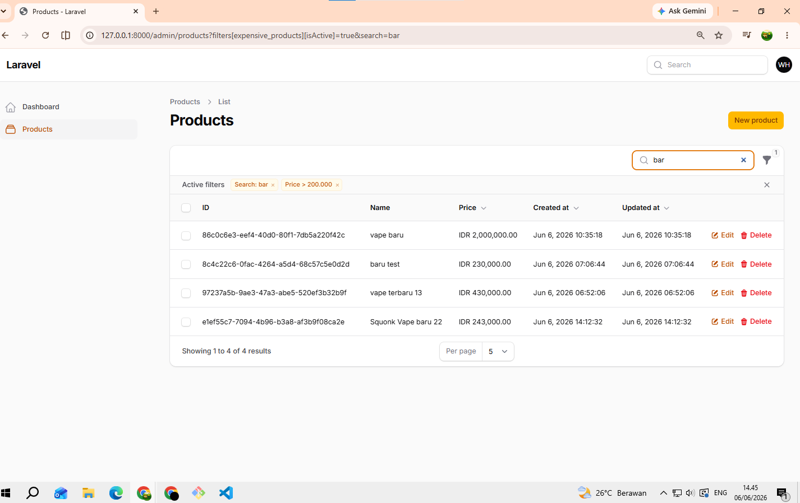

# VapeBay — Technical Test Full-Stack Developer

Aplikasi manajemen produk full-stack yang dibangun menggunakan NestJS, Nuxt.js, dan Laravel Filament.

## Arsitektur Sistem

Browser -> Nuxt.js Frontend (port 3000) -> NestJS API (port 3001) -> PostgreSQL Database

Admin User -> Laravel Filament (port 8000) -> PostgreSQL Database

## Komponen Sistem

- Nuxt.js Frontend digunakan oleh pengguna untuk melihat daftar produk, mencari produk, menambahkan produk, dan menggunakan fitur pagination.
- NestJS API berfungsi sebagai backend yang menyediakan REST API untuk pengelolaan data produk serta melakukan validasi data.
- Laravel Filament digunakan sebagai panel admin untuk mengelola produk melalui fitur CRUD, pencarian, dan filter data.
- PostgreSQL digunakan sebagai database utama yang diakses oleh NestJS API dan Laravel Filament.

## Alur Data

1. Pengguna mengakses aplikasi melalui Nuxt.js Frontend.
2. Frontend mengirimkan request ke NestJS API.
3. NestJS API mengambil atau menyimpan data ke PostgreSQL.
4. Data dikembalikan ke Frontend dalam format JSON.
5. Administrator mengelola data produk melalui Laravel Filament yang terhubung langsung ke database PostgreSQL yang sama.

## Tech Stack

- Frontend | Nuxt.js 4, Tailwind CSS, Lucide Icons
- Backend API | NestJS, TypeORM, PostgreSQL
- Admin Panel | Laravel 12, Filament v5
- Database | PostgreSQL
- Infrastructure | Digital Ocean, Terraform

## Prasyarat

Pastikan sudah terinstall di komputer kamu:

- Node.js v20+
- PHP 8.2+
- Composer
- PostgreSQL

---

## Cara Menjalankan Lokal

### 1. Clone repository

```git bash
git clone https://github.com/wawanher487/vapebay-technical-test.git
cd vapebay-technical-test
```

### 2. Setup Database

jalankan database posgresql

```terminal
psql -U postgres
```

Buat database PostgreSQL:

```sql
CREATE DATABASE product_db;
```

### 3. Jalankan NestJS API

```git bash
cd product-api
npm install
```

Buat file `.env`:

```env
DB_HOST=localhost
DB_PORT=5432
DB_USERNAME=postgres
DB_PASSWORD=your_password
DB_NAME=product_db
```

```git bash
npm run start:dev
# API berjalan di http://localhost:3001
```

### 4. Jalankan Nuxt.js Frontend

```git bash
cd product-frontend
npm install
```

Buat file `.env`:

```env
API_BASE_URL=http://localhost:3001
```

```git bash
npm run dev
# Frontend berjalan di http://localhost:3000
```

### 5. Jalankan Laravel Filament Admin

```git bash
cd product-admin
composer install
```

Buat file `.env` (copy dari `.env.example`):

```git bash
cp .env.example .env
php artisan key:generate
```

Edit `.env`:

```env
DB_CONNECTION=pgsql
DB_HOST=127.0.0.1
DB_PORT=5432
DB_DATABASE=product_db
DB_USERNAME=postgres
DB_PASSWORD=your_password
```

```git bash
php artisan make:filament-user
php artisan serve --port=8000
# Admin panel berjalan di http://localhost:8000/admin
```

---

## Endpoint API

- GET | `/api/products` | Ambil semua produk
- POST | `/api/products` | Tambah produk baru

---

## Fitur Aplikasi

### Frontend (Nuxt.js)

- Menampilkan daftar produk dari API
- Form tambah produk baru dengan validasi
- Pencarian produk secara realtime (client-side)
- Pagination (6 produk per halaman)
- Loading skeleton saat fetch data
- Empty state yang informatif

### Admin Panel (Laravel Filament)

- CRUD produk lengkap (Create, Read, Update, Delete)
- Pencarian berdasarkan nama produk
- Filter produk berdasarkan harga
- Sorting per kolom
- Bulk delete

---

## Screenshot

### Frontend — Daftar Produk dengan Pagination


### Frontend — Fitur Pencarian



### Admin — Daftar Produk



### Admin — Tambah Produk



### Admin — Filter Produk



---

## CI/CD Pipeline (GitLab CI)

Pipeline dikonfigurasi di file `.gitlab-ci.yml` dan terdiri dari dua tahap:

### Tahap 1: Build

Tiga job berjalan paralel:

- **build:nestjs** — install dependencies dan compile TypeScript ke JavaScript
- **build:nuxtjs** — install dependencies dan generate output Nuxt
- **build:laravel** — install dependencies PHP dan cache konfigurasi Laravel

### Tahap 2: Deploy

- Hanya berjalan saat ada push ke branch `main`
- Memerlukan konfirmasi manual (`when: manual`) sebelum dieksekusi
- Langkah deployment: SSH ke server → pull kode → restart service dengan PM2 → jalankan migration

---

## Infrastruktur — Digital Ocean & Terraform

### Strategi Deployment

Aplikasi di-deploy ke **Digital Ocean** menggunakan satu Droplet (VPS) dengan spesifikasi minimal:

- **OS**: Ubuntu 22.04
- **RAM**: 2GB
- **CPU**: 1 vCPU
- **Storage**: 50GB SSD

### Resource yang Dikelola Terraform

Jika menggunakan Terraform untuk provisioning, resource yang akan dibuat:

1. **digitalocean_droplet** — VPS utama untuk menjalankan semua service
2. **digitalocean_database_cluster** — Managed PostgreSQL database (lebih reliable dari self-hosted)
3. **digitalocean_firewall** — Aturan firewall: izinkan port 80, 443, 22 (SSH), blokir akses langsung ke port 3001 dan 8000
4. **digitalocean_domain** — Konfigurasi domain untuk aplikasi
5. **digitalocean_record** — DNS record yang mengarahkan domain ke IP Droplet


